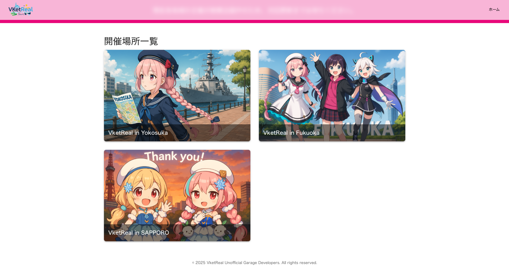

# Site Template



VketReal in Toursは、有志開催のVketRealのポータルサイトです。  
VketRealの各会場へのリンクを集約し、訪問者が簡単にアクセスできるようにすることを目的としています。

This project is built using [Next.js](https://nextjs.org/) and is designed to be a simple, fast, and efficient portal for VketReal events.


## Getting Started

First, run the development server:

```bash
npm run dev
# or
yarn dev
# or
pnpm dev
# or
bun dev
```

Open [http://localhost:3000](http://localhost:3000) with your browser to see the result.

You can start editing the page by modifying `app/page.tsx`. The page auto-updates as you edit the file.